# STOCK-EXCHANGE UML Diagram

Below is the complete and comprehensive UML class diagram for the Stock Exchange project, generated from the source code. It includes all model classes, engine systems, persistence layers, exceptions, and UI components along with their methods and fields.

```mermaid
classDiagram
    class App {
        -PriceSimulator simulator
        -Stage stage
        +start(Stage primaryStage) void
        +stop() void
        +main(String[] args) void
    }
    Application <|-- App
    App --> PriceSimulator
    
    class Main {
        +main(String[] args) void
    }
    
    class BotTrader {
        -Exchange exchange
        -Trader trader
        -long intervalMillis
        -Thread thread
        +start() void
        +stop() void
        +run() void
        -placeRandomOrder() void
    }
    Runnable <|.. BotTrader
    BotTrader --> Exchange
    BotTrader --> Trader
    
    class Exchange {
        -Map~String, Stock~ stocks
        -Map~String, Trader~ traders
        -List~Trade~ tradeHistory
        -Map~String, OrderBook~ orderBooks
        -BlockingQueue~Order~ orderQueue
        -List~MarketListener~ listeners
        -Thread engineThread
        -boolean isRunning
        +getInstance() Exchange
        +start() void
        +stop() void
        -processOrders() void
        +placeOrder(Order order) void
        +cancelOrder(Order order) void
        +registerStock(Stock stock) void
        +registerTrader(Trader trader) void
        +getStock(String symbol) Stock
        +getTrader(String id) Trader
        +getStocks() Collection~Stock~
        +getTraders() Collection~Trader~
        +getTradeHistory() List~Trade~
        +getOrderBook(String symbol) OrderBook
        +addListener(MarketListener listener) void
        +removeListener(MarketListener listener) void
        -notifyPriceUpdate(Stock stock) void
        -notifyTrade(Trade trade) void
        -notifyOrderBook(String symbol) void
        +restoreState(List~Stock~ stocks, List~Trader~ traders, List~Trade~ trades) void
    }
    
    class MatchingEngine {
        +match(Order newOrder, OrderBook book) List~Trade~
        -executeTrade(Order buy, Order sell, double price) Trade
    }
    
    class OrderBook {
        -String symbol
        -PriorityQueue~LimitOrder~ bids
        -PriorityQueue~LimitOrder~ asks
        +addOrder(Order order) void
        +removeOrder(Order order) void
        +getBids() PriorityQueue~LimitOrder~
        +getAsks() PriorityQueue~LimitOrder~
        +getSymbol() String
    }
    
    class PriceSimulator {
        -Exchange exchange
        -long intervalMillis
        -double volatility
        -Thread thread
        -boolean isRunning
        +start() void
        +stop() void
        +run() void
        -simulatePriceWalk() void
    }
    Runnable <|.. PriceSimulator
    PriceSimulator --> Exchange
    
    class AssetType {
        <<enumeration>>
        +String label
    }
    
    class OrderSide {
        <<enumeration>>
        +String label
    }
    
    class OrderStatus {
        <<enumeration>>
        +String label
    }
    
    class OrderType {
        <<enumeration>>
        +String label
    }
    
    class InsufficientFundsException {
        -double required
        -double available
        +getRequired() double
        +getAvailable() double
    }
    TradingException <|-- InsufficientFundsException
    
    class InsufficientSharesException {
        -String symbol
        -int requested
        -int owned
        +getSymbol() String
        +getRequested() int
        +getOwned() int
    }
    TradingException <|-- InsufficientSharesException
    
    class InvalidOrderException {
    }
    TradingException <|-- InvalidOrderException
    
    class TradingException {
    }
    Exception <|-- TradingException
    
    class Admin {
        -long serialVersionUID
        +role() String
        +canManageMarket() boolean
    }
    Trader <|-- Admin
    
    class Holding {
        -long serialVersionUID
        -String symbol
        -int quantity
        -double averageCost
        +addShares(int qty, double price) void
        +removeShares(int qty) void
        +getSymbol() String
        +getQuantity() int
        +getAverageCost() double
    }
    Serializable <|.. Holding
    
    class InstitutionalTrader {
        -long serialVersionUID
        -double COMMISSION
        -int MAX_ORDER
        +commissionRate() double
        +maxOrderSize() int
        +role() String
    }
    Trader <|-- InstitutionalTrader
    
    class LimitOrder {
        -long serialVersionUID
        -double limitPrice
        +getType() OrderType
        +acceptsPrice(double price) boolean
        +getLimitPrice() double
        +toString() String
    }
    Order <|-- LimitOrder
    
    class MarketOrder {
        -long serialVersionUID
        +getType() OrderType
        +acceptsPrice(double price) boolean
    }
    Order <|-- MarketOrder
    
    class Order {
        -long serialVersionUID
        -AtomicLong ARRIVAL_SEQUENCE
        -String id
        #Trader owner
        #Stock stock
        #OrderSide side
        #int quantity
        #int filledQuantity
        #OrderStatus status
        -long sequence
        -long timestamp
        +getType() OrderType
        +acceptsPrice(double price) boolean
        +fill(int qty) void
        +cancel() void
        +getRemainingQuantity() int
        +isActive() boolean
        +getId() String
        +getOwner() Trader
        +getStock() Stock
        +getSide() OrderSide
        +getQuantity() int
        +getFilledQuantity() int
        +getStatus() OrderStatus
        +getTimestamp() long
        +isBuy() boolean
        +compareTo(Order other) int
        +toString() String
    }
    Comparable <|.. Order
    Order --> Trader
    Order --> Stock
    Order --> OrderSide
    Order --> OrderStatus
    
    class Portfolio {
        -long serialVersionUID
        -double DEFAULT_STARTING_CASH
        -String ownerId
        -double cashBalance
        -Map~String, Holding~ holdings
        +deposit(double amount) void
        +withdraw(double amount) void
        +addShares(String symbol, int qty, double price) void
        +removeShares(String symbol, int qty) void
        +hasShares(String symbol, int qty) boolean
        +getHoldings() Collection~Holding~
        +getHolding(String symbol) Holding
        +getCashBalance() double
        +getOwnerId() String
        +setOwnerId(String ownerId) void
    }
    Serializable <|.. Portfolio
    
    class RetailTrader {
        -long serialVersionUID
        -double COMMISSION
        -int MAX_ORDER
        -double STARTING_CASH
        +commissionRate() double
        +maxOrderSize() int
        +role() String
    }
    Trader <|-- RetailTrader
    
    class Stock {
        -long serialVersionUID
        -String symbol
        -String name
        -AssetType type
        -double openPrice
        -double lastPrice
        -List~Double~ priceHistory
        +updatePrice(double newPrice) void
        +getSymbol() String
        +getName() String
        +setName(String name) void
        +getType() AssetType
        +setType(AssetType type) void
        +getOpenPrice() double
        +getLastPrice() double
        +getChangePercent() double
        +getPriceHistory() List~Double~
        +toString() String
        +equals(Object o) boolean
        +hashCode() int
    }
    Serializable <|.. Stock
    Stock --> AssetType
    
    class Trade {
        -long serialVersionUID
        -DateTimeFormatter FMT
        -String id
        -String symbol
        -String buyerId
        -String sellerId
        -int quantity
        -double price
        -LocalDateTime time
        +fromCsv(String[] t) Trade
        +getValue() double
        +toCsv() String
        +csvHeader() String
        +getId() String
        +getSymbol() String
        +getBuyerId() String
        +getSellerId() String
        +getQuantity() int
        +getPrice() double
        +getTime() LocalDateTime
        +toString() String
    }
    Serializable <|.. Trade
    
    class Trader {
        -long serialVersionUID
        #String id
        #String name
        -int passwordHash
        #Portfolio portfolio
        +commissionRate() double
        +maxOrderSize() int
        +role() String
        +computeCommission(double tradeValue) double
        +canManageMarket() boolean
        +verifyPassword(String attempt) boolean
        -hash(String password) int
        +getId() String
        +getName() String
        +setName(String name) void
        +getPortfolio() Portfolio
        +toString() String
    }
    Serializable <|.. Trader
    Trader --> Portfolio
    
    class MarketListener {
        <<interface>>
        +onPriceUpdate(Stock stock) void
        +onTrade(Trade trade) void
        +onOrderBookChanged(String symbol) void
    }
    
    class OrderFactory {
        +create(Trader trader, Stock stock, OrderSide side, OrderType type, int quantity, double limitPrice) Order
    }
    
    class BinaryRepository {
        -File file
        +save(List~T~ items) void
        +load() List~T~
    }
    
    class CsvMapper {
        <<interface>>
        +header() String
        +toLine(T item) String
        +fromTokens(String[] tokens) T
    }
    
    class CsvRepository {
        -File file
        -CsvMapper~T~ mapper
        +save(List~T~ items) void
        +load() List~T~
    }
    
    class DataStore {
        -Repository~Stock~ stockRepo
        -Repository~Trade~ tradeRepo
        -Repository~Trader~ traderRepo
        -String logPath
        +newTransactionLogger() TransactionLogger
        +saveAll(Exchange exchange) void
        +loadAll(Exchange exchange) void
        -safeLoadStocks() List~Stock~
        -safeLoadTraders() List~Trader~
        -safeLoadTrades() List~Trade~
        -seedDefaultMarket(Exchange exchange) void
        -seedDefaultTraders(Exchange exchange) void
    }
    
    class Repository {
        <<interface>>
        +save(List~T~ items) void
        +load() List~T~
    }
    
    class StockCsvMapper {
        +header() String
        +toLine(Stock s) String
        +fromTokens(String[] t) Stock
    }
    CsvMapper <|.. StockCsvMapper
    
    class TradeCsvMapper {
        +header() String
        +toLine(Trade trade) String
        +fromTokens(String[] tokens) Trade
    }
    CsvMapper <|.. TradeCsvMapper
    
    class TransactionLogger {
        -File file
        +onPriceUpdate(Stock stock) void
        +onTrade(Trade trade) void
        +onOrderBookChanged(String symbol) void
        -log(String msg) void
    }
    MarketListener <|.. TransactionLogger
    
    class DashboardView {
        -Exchange exchange
        -Trader user
        -Runnable onLogout
        -BorderPane root
        -Label cashLabel
        -ObservableList~Stock~ marketItems
        -TableView~Stock~ marketTable
        -String chartSymbol
        -ComboBox~String~ orderSymbol
        -ChoiceBox~OrderSide~ sideBox
        -ChoiceBox~OrderType~ typeBox
        -Spinner~Integer~ qtySpinner
        -TextField limitField
        -Label orderMsg
        -ObservableList~Holding~ holdingItems
        -TableView~Holding~ holdingsTable
        -Label portfolioValueLabel
        -ComboBox~String~ bookSymbol
        -ObservableList~LimitOrder~ bidItems
        -ObservableList~LimitOrder~ askItems
        -TableView~LimitOrder~ bidsTable
        -TableView~LimitOrder~ asksTable
        -Label spreadLabel
        -ObservableList~Trade~ tradeItems
        -TableView~Trade~ tradesTable
        -ObservableList~Trader~ traderItems
        +getRoot() Parent
        -build() void
        -buildHeader() HBox
        -buildTabs() TabPane
        -buildMarketTab() Parent
        -buildOrderForm() VBox
        -submitOrder() void
        -showOrderMsg(String text, boolean error) void
        -buildPortfolioTab() Parent
        -buildOrderBookTab() Parent
        -buildHistoryTab() Parent
        -buildAdminTab() Parent
        +onPriceUpdate(Stock stock) void
        +onTrade(Trade trade) void
        +onOrderBookChanged(String symbol) void
        -refreshAll() void
        -refreshSymbols() void
        -refreshMarket() void
        -refreshPortfolio() void
        -refreshHistory() void
        -refreshOrderBook() void
        -refreshChart() void
        -selectSymbol(String symbol) void
        -updateCash() void
        -sectionTitle(String text) Label
        -bestBid(String symbol) Double
        -bestAsk(String symbol) Double
        -currentPrice(String symbol) Double
        -marketValue(Holding h) String
        -unrealizedPnl(Holding h) String
        -priceOrDash(Double price) String
    }
    MarketListener <|.. DashboardView
    DashboardView --> Exchange
    DashboardView --> Trader
    
    class LoginView {
        -Exchange exchange
        -Consumer~Trader~ onLoginSuccess
        -StackPane root
        +getRoot() Parent
        -build() void
        -handleLogin(String id, String password, Label message) void
        -handleRegister(String id, String password, String role, Label message) void
        -isBlank(String s) boolean
    }
    LoginView --> Exchange
    
    class IdGenerator {
        -AtomicLong ORDER_SEQ
        -AtomicLong TRADE_SEQ
        +nextOrderId() String
        +nextTradeId() String
    }
    
    class Money {
        -String CURRENCY
        +round(double amount) double
        +format(double amount) String
        +format(double amount, String symbol) String
    }
```

